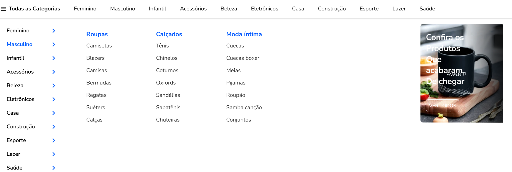
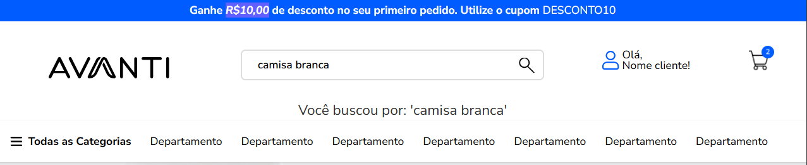

# Projeto - Processo Seletivo Avanti 🚀

Este projeto foi desenvolvido como parte do **processo seletivo do programa de estágio Innovation Class Tech - Desenvolvimento Front-End**.

🔗 Link do teste técnico: [Processo Seletivo Avanti](https://ic.penseavanti.com.br/mod/page/view.php?id=51)

🔗Link do projeto no GitHub Pages: [GitHub Pages](https://github.com/Amanda-Berwig/Avanti--innovation-class/deployments/github-pages)

## 📝 Requisitos para o desenvolvimento

✅ **1. Estruturação HTML**

- O layout foi seguido conforme o Figma proposto pela empresa.
  🖼️ Link do Figma: [Acessar o Layout no Figma](https://www.figma.com/proto/DqtFxC6312M32mLt8FpJjq/innovation-class?page-id=13%3A673&node-id=13-920&viewport=346%2C140%2C0.11&t=HyGGDSs83f1vbqMJ-1&scaling=scale-down&content-scaling=fixed)

✅ **2. Estilização com CSS (Responsivo)**

- O projeto contempla tanto a versão **Desktop** quanto a **Mobile**.

✅ **3. Funcionalidade de Busca com JavaScript**

- Ao digitar um termo no campo de busca e clicar no botão da lupa, é exibida a mensagem:  
  `"Você buscou por: 'assunto buscado'"`.

✅ **4. Interação com Carrosséis**

- Os carrosséis foram implementados com a biblioteca **Swiper.js**, garantindo uma navegação fluida entre os itens.

---

## 📸 Prints do Projeto

### 💻 Versão Desktop




### 📱 Versão Mobile


### 🔎 Funcionalidade de Busca



---

## 🛠️ Tecnologias Utilizadas

- HTML5
- Tailwind CSS
- JavaScript
- Biblioteca de carrossel: [Swiper.js](https://swiperjs.com/)

---

## ▶️ Como executar o projeto

1. Clone o repositório:

```bash
git clone https://github.com/seuusuario/nome-do-projeto.git
```

2. Acesse a pasta do projeto:

```bash
cd nome-do-projeto
```

3. Abra o arquivo index.html diretamente no navegador, ou utilize uma extensão como o Live Server (VS Code) para executar o projeto localmente.
